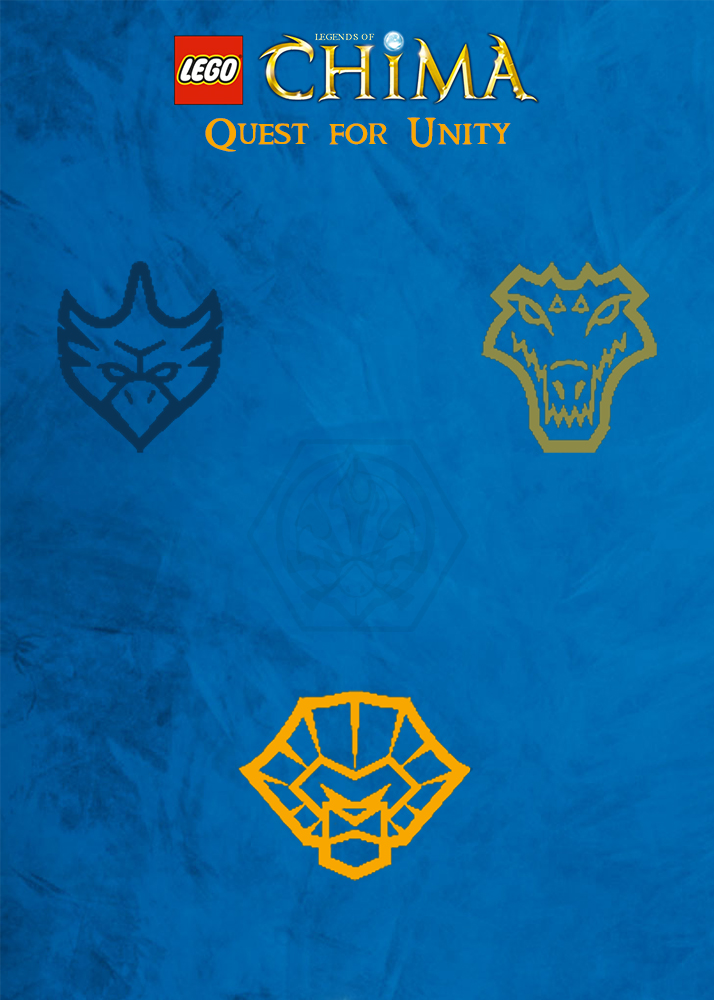

A little over a year after the Illumination, war once more divides the Tribes as it becomes unclear who should guard and distribute the Chi. Horrified at seeing Chima once more turn against itself, 3 friends set out on a journey to find the remnants of the Phoenix to hopefully make contact and quickly end the war. But, are the Phoenix truly needed? Or are these 3 actually enough?